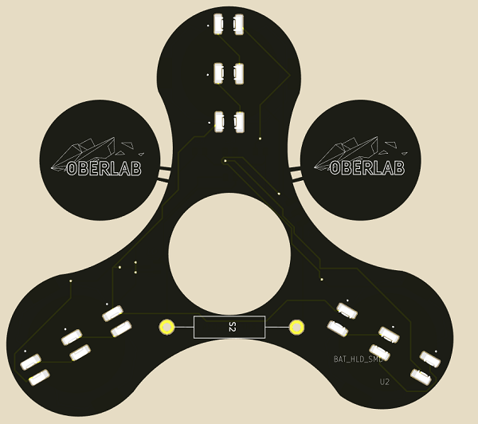

  |[:skull:ISSUE](https://github.com/frankyhub/LOGO_Steuerungstechnik/issues?q=is%3Aissue)|[:speech_balloon: Forum /Discussion](https://github.com/frankyhub/Markdown/discussions?discussions_q=)|[:grey_question:WiKi](https://github.com/frankyhub/LOGO_Steuerungstechnik/wiki/Sicherheitsbestimmungen)|
|--|--|--|
| | | |
||||
|| | |

---

## Fidget_Spinner
SMD Loetuebung

## Hardware

| Anzahl | Bezeichnung | 
| -------- | -------- | 
| 3  | SMD Bat.Holder   |
| 3  |  CR2032  |
| 1  |  Mini-Schalter  |
|  1 |  1k  |
|  3 |  150R  |
| 9  |  LEDs  |
| 1  |  SW-200D  |
| 1  | BC846B   |
|  1 | Kugellager 22mm   | 
|  1 |  Platine  | 
| ---  |  ---  | 

---

   
<ol class="breadcrumb" style="border-top: 2px solid black;border-bottom:2px solid black; height: 45px; width: 900px;"> 
<a href="#oben">nach oben</a>
</ol>

  

---
